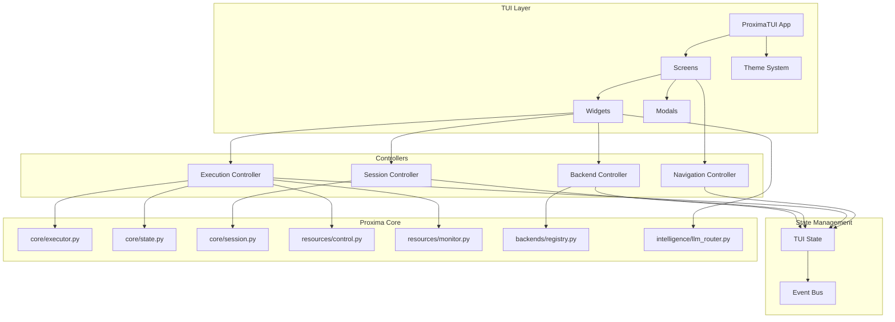

# Proxima TUI Redesign - Complete Implementation Plan

A comprehensive, highly-detailed plan for creating a new professional Terminal User Interface for Proxima's Quantum Simulation Orchestration Framework, inspired by Crush AI's modern design.

---

## Table of Contents

1. [Executive Summary](#executive-summary)
2. [Design Inspiration Analysis](#design-inspiration-analysis)
3. [Proxima Functional Requirements](#proxima-functional-requirements)
4. [Architecture Overview](#architecture-overview)
5. [Directory Structure](#directory-structure)
6. [Theme System Specification](#theme-system-specification)
7. [Component Specifications](#component-specifications)
8. [Screen Specifications](#screen-specifications)
9. [State Management](#state-management)
10. [Event System](#event-system)
11. [Keybindings](#keybindings)
12. [Integration Points](#integration-points)
13. [Implementation Phases](#implementation-phases)
14. [Verification Plan](#verification-plan)

---

## Executive Summary

This plan outlines a complete TUI redesign for Proxima, the Quantum Simulation Orchestration Framework. The new interface will provide a smooth, professional experience for managing quantum simulations, monitoring execution, viewing results, and comparing backends.

**Key Goals:**
- Professional dark theme with magenta/purple accents (Crush-inspired)
- Right-aligned sidebar with real-time status (execution state, memory, backends)
- Command palette with fuzzy search and categorization
- Permission dialogs for consent management
- Real-time execution monitoring with progress and checkpoints
- Quantum-specific visualizations (probability distributions, state vectors)

---

## Design Inspiration Analysis

Based on analysis of Crush AI's codebase and screenshots:

### Key Patterns from Crush to Adopt

````carousel

<!-- slide -->

<!-- slide -->

<!-- slide -->

<!-- slide -->

````

### Crush Architecture Insights (from codebase analysis)

| Component | Crush Implementation | Proxima Adaptation |
|-----------|---------------------|-------------------|
| **Theme** | 50+ colors, gradient utilities, Manager pattern | Same structure with quantum-themed colors |
| **Sidebar** | Dynamic height, collapsible sections, compact mode | Add Backends, Memory, Checkpoints sections |
| **Logo** | ASCII letterforms with stretch, gradient colors | PROXIMA with quantum-wave motif |
| **Commands** | 3-tab system (System/User/MCP), FilterableList | Execution/Session/Backend categories |
| **Permissions** | 3-tier (Allow/AllowSession/Deny), diff view | Adapt for Consent Manager integration |
| **Dialogs** | 9 types, unified Dialog interface | Add quantum-specific dialogs |

---

## Proxima Functional Requirements

### From Codebase Analysis

#### 1. Execution States (from `core/state.py`)
```python
class ExecutionState(Enum):
    IDLE = "IDLE"           # No active execution
    PLANNING = "PLANNING"   # Creating execution plan  
    READY = "READY"         # Plan ready, awaiting confirmation
    RUNNING = "RUNNING"     # Currently executing
    PAUSED = "PAUSED"       # Execution paused (checkpointed)
    COMPLETED = "COMPLETED" # Successfully finished
    ABORTED = "ABORTED"     # User cancelled
    ERROR = "ERROR"         # Execution failed
    RECOVERING = "RECOVERING" # Recovering from crash
```

#### 2. Control Signals (from `resources/control.py`)
```python
class ControlSignal(Enum):
    NONE = auto()
    START = auto()     # Begin execution
    PAUSE = auto()     # Pause with checkpoint
    RESUME = auto()    # Resume from checkpoint
    ABORT = auto()     # Cancel execution
    ROLLBACK = auto()  # Rollback to previous checkpoint
```

#### 3. Memory Levels (from `resources/monitor.py`)
```python
class MemoryLevel(Enum):
    OK = auto()        # < 60%
    INFO = auto()      # 60-80%
    WARNING = auto()   # 80-95%
    CRITICAL = auto()  # 95-98%
    ABORT = auto()     # > 98%
```

#### 4. Session Status (from `core/session.py`)
```python
class SessionStatus(Enum):
    ACTIVE = "active"
    PAUSED = "paused"
    COMPLETED = "completed"
    ABORTED = "aborted"
    ERROR = "error"
    CRASHED = "crashed"
    RECOVERING = "recovering"
```

#### 5. Backend Health (from `backends/registry.py`)
```python
class BackendHealthStatus(Enum):
    HEALTHY = "healthy"
    DEGRADED = "degraded"
    UNHEALTHY = "unhealthy"
    UNKNOWN = "unknown"
```

#### 6. Supported Backends
- **LRET** - Local Realistic Entanglement Theory
- **Cirq** - Google's quantum framework (DensityMatrix, StateVector)
- **Qiskit Aer** - IBM quantum simulator (DensityMatrix, StateVector)
- **cuQuantum** - NVIDIA GPU acceleration
- **qsim** - Google's high-performance simulator
- **QuEST** - Quantum Exact Simulation Toolkit

---

## Architecture Overview



---

## Directory Structure

```
src/proxima/tui/
├── __init__.py                    # Package init with launch() function
├── app.py                         # Main ProximaTUI application class (Textual App)
├── keys.py                        # Global keybinding definitions
│
├── styles/
│   ├── __init__.py
│   ├── theme.py                   # Theme class with all colors and styles
│   ├── icons.py                   # Unicode icons and symbols
│   ├── markdown.py                # Markdown rendering configuration
│   └── base.tcss                  # Textual CSS base styles
│
├── state/
│   ├── __init__.py
│   ├── tui_state.py               # Central TUI state dataclass
│   └── events.py                  # Custom event definitions
│
├── controllers/
│   ├── __init__.py
│   ├── navigation.py              # Screen navigation controller
│   ├── execution.py               # Execution control (start/pause/resume/abort)
│   ├── session.py                 # Session management integration
│   └── backends.py                # Backend registry integration
│
├── components/
│   ├── __init__.py
│   ├── core/
│   │   ├── __init__.py
│   │   ├── section.py             # Section header rendering
│   │   └── layout.py              # Layout utilities (Sizeable interface)
│   ├── logo/
│   │   ├── __init__.py
│   │   └── logo.py                # ASCII PROXIMA logo with gradient
│   ├── sidebar/
│   │   ├── __init__.py
│   │   ├── sidebar.py             # Main sidebar component
│   │   ├── backends_section.py    # Backend status section
│   │   ├── memory_section.py      # Memory monitoring section
│   │   ├── session_section.py     # Session info section
│   │   └── results_section.py     # Recent results section
│   ├── progress/
│   │   ├── __init__.py
│   │   ├── progress_bar.py        # Animated progress bar
│   │   └── stage_timeline.py      # Execution stage timeline
│   ├── editor/
│   │   ├── __init__.py
│   │   └── input_area.py          # Main text input area
│   └── viewers/
│       ├── __init__.py
│       ├── result_viewer.py       # Probability distribution viewer
│       ├── diff_viewer.py         # Diff display (for comparisons)
│       └── code_viewer.py         # Syntax-highlighted code view
│
├── dialogs/
│   ├── __init__.py
│   ├── base.py                    # Base Dialog interface
│   ├── common.py                  # Common dialog utilities
│   ├── commands/
│   │   ├── __init__.py
│   │   ├── commands.py            # Command palette dialog
│   │   └── command_item.py        # Command item component
│   ├── permissions/
│   │   ├── __init__.py
│   │   └── permissions.py         # Permission/consent dialog
│   ├── models/
│   │   ├── __init__.py
│   │   ├── models.py              # LLM model selection dialog
│   │   └── models_item.py         # Model item component
│   ├── backends/
│   │   ├── __init__.py
│   │   └── backends.py            # Backend selection dialog
│   ├── sessions/
│   │   ├── __init__.py
│   │   ├── sessions.py            # Session switcher dialog
│   │   └── session_item.py        # Session item component
│   ├── confirmation/
│   │   ├── __init__.py
│   │   └── confirmation.py        # Generic confirmation dialog
│   ├── error/
│   │   ├── __init__.py
│   │   └── error.py               # Error display dialog
│   └── input/
│       ├── __init__.py
│       └── input.py               # Text input prompt dialog
│
├── screens/
│   ├── __init__.py
│   ├── base.py                    # Base screen class
│   ├── dashboard.py               # Main dashboard screen
│   ├── execution.py               # Execution monitoring screen
│   ├── results.py                 # Results browser screen
│   ├── backends.py                # Backend management screen
│   ├── settings.py                # Configuration screen
│   └── help.py                    # Help documentation screen
│
└── util/
    ├── __init__.py
    ├── model.py                   # Model base interface
    ├── gradient.py                # Gradient color utilities
    └── truncate.py                # Text truncation utilities
```

**Total: 53 files across 19 directories**

---

## Theme System Specification

### Color Palette

```python
# file: src/proxima/tui/styles/theme.py

from dataclasses import dataclass, field
from typing import Dict
import colorsys

@dataclass
class ProximaTheme:
    """Proxima TUI Theme - Quantum-inspired dark theme with magenta accents."""
    
    name: str = "proxima-dark"
    is_dark: bool = True
    
    # Primary Accent Colors (Magenta/Purple gradient)
    primary: str = "#FF00FF"          # Magenta
    primary_light: str = "#FF66FF"    # Light magenta
    primary_dark: str = "#AA00AA"     # Dark magenta
    secondary: str = "#AA00FF"        # Purple
    secondary_light: str = "#CC66FF"  # Light purple
    tertiary: str = "#6600CC"         # Deep purple
    accent: str = "#00FFFF"           # Cyan (quantum highlight)
    
    # Background Colors
    bg_darkest: str = "#0a0a0a"       # Deepest background
    bg_base: str = "#121212"          # Main background
    bg_base_lighter: str = "#1a1a1a"  # Slightly lighter
    bg_subtle: str = "#242424"        # Subtle panels
    bg_overlay: str = "#2a2a2a"       # Dialogs/modals
    bg_elevated: str = "#333333"      # Elevated elements
    
    # Foreground Colors
    fg_base: str = "#FFFFFF"          # Primary text
    fg_muted: str = "#B0B0B0"         # Secondary text
    fg_half_muted: str = "#909090"    # Dimmed text
    fg_subtle: str = "#707070"        # Very dim text
    fg_selected: str = "#FFFFFF"      # Selected text
    fg_disabled: str = "#505050"      # Disabled text
    
    # Border Colors
    border: str = "#333333"           # Default border
    border_focus: str = "#FF00FF"     # Focused border
    border_subtle: str = "#2a2a2a"    # Subtle border
    
    # Status Colors
    success: str = "#00FF66"          # Success green
    success_dark: str = "#00AA44"     # Dark success
    error: str = "#FF3333"            # Error red
    error_dark: str = "#AA2222"       # Dark error
    warning: str = "#FFAA00"          # Warning orange
    warning_dark: str = "#CC8800"     # Dark warning
    info: str = "#00AAFF"             # Info blue
    info_dark: str = "#0088CC"        # Dark info
    
    # Execution State Colors
    state_idle: str = "#808080"       # Gray
    state_planning: str = "#FFAA00"   # Orange
    state_ready: str = "#00AAFF"      # Blue
    state_running: str = "#00FF66"    # Green
    state_paused: str = "#FFAA00"     # Orange
    state_completed: str = "#00FF66"  # Green
    state_error: str = "#FF3333"      # Red
    state_aborted: str = "#FF6600"    # Orange-red
    state_recovering: str = "#AA00FF" # Purple
    
    # Memory Level Colors
    memory_ok: str = "#00FF66"        # Green (< 60%)
    memory_info: str = "#00AAFF"      # Blue (60-80%)
    memory_warning: str = "#FFAA00"   # Orange (80-95%)
    memory_critical: str = "#FF6600"  # Orange-red (95-98%)
    memory_abort: str = "#FF3333"     # Red (> 98%)
    
    # Backend Health Colors
    health_healthy: str = "#00FF66"   # Green
    health_degraded: str = "#FFAA00"  # Orange
    health_unhealthy: str = "#FF3333" # Red
    health_unknown: str = "#808080"   # Gray
    
    # Diff Colors (for comparisons)
    diff_insert_bg: str = "#1a2f1a"   # Green-tinted background
    diff_insert_fg: str = "#00FF66"   # Green text
    diff_delete_bg: str = "#2f1a1a"   # Red-tinted background
    diff_delete_fg: str = "#FF6666"   # Red text
    diff_change_bg: str = "#2a2a1a"   # Yellow-tinted background
    diff_change_fg: str = "#FFFF66"   # Yellow text
    
    # Quantum-specific Colors
    qubit_zero: str = "#00AAFF"       # |0⟩ state blue
    qubit_one: str = "#FF00FF"        # |1⟩ state magenta
    entangled: str = "#AA00FF"        # Entanglement purple
    superposition: str = "#00FFFF"    # Superposition cyan
```

### Gradient Utilities

```python
def apply_gradient(text: str, color_start: str, color_end: str, bold: bool = False) -> str:
    """Apply horizontal gradient to text."""
    # Implementation using Rich or Textual styling
    pass

def blend_colors(size: int, *colors: str) -> list[str]:
    """Generate color ramp between multiple stops."""
    # Implementation using colorful library
    pass
```

### Icons

```python
# file: src/proxima/tui/styles/icons.py

# Status Icons
ICON_CHECK = "✓"
ICON_CROSS = "✗"
ICON_RUNNING = "●"
ICON_PAUSED = "⏸"
ICON_IDLE = "○"
ICON_WARNING = "⚠"
ICON_ERROR = "✗"
ICON_INFO = "ℹ"

# Backend Icons
ICON_BACKEND = "⬡"
ICON_HEALTHY = "●"
ICON_DEGRADED = "◐"
ICON_UNHEALTHY = "○"

# Progress Icons  
ICON_STAGE_DONE = "✓"
ICON_STAGE_CURRENT = "●"
ICON_STAGE_PENDING = "○"

# Quantum Icons
ICON_QUBIT = "⟩"
ICON_ENTANGLE = "⊗"
ICON_SUPERPOS = "∿"

# Model Icons
ICON_MODEL = "◈"
ICON_THINKING = "◆"

# Memory Icons
ICON_MEMORY = "▓"
ICON_MEMORY_EMPTY = "░"

# Radio Buttons
RADIO_ON = "●"
RADIO_OFF = "○"
```

---

## Component Specifications

### 1. ASCII Logo (`components/logo/logo.py`)

PROXIMA logo with quantum-wave aesthetic:

```
 ____  ____   ____  _  _ _____ __  __     _    
|  _ \|  _ \ / __ \| \/ |_   _|  \/  |   / \   
| |_) | |_) | |  | |    | | | | \  / |  / _ \  
|  __/|  _ <| |  | |    | | | | |\/| | / ___ \ 
|_|   |_| \_\|____/|_/\_|_____|_|  |_|/_/   \_\
```

**Features:**
- Gradient coloring: secondary → primary (purple → magenta)
- Stretchable letters (random letter stretches on each render)
- Compact mode: `Proxima™ PROXIMA` with gradient
- Diagonal field lines (`╱`) on sides

**Implementation Pattern (from Crush):**
```python
class Logo:
    def render(self, version: str, compact: bool, width: int) -> str:
        if compact:
            return self._render_compact(width)
        return self._render_full(version, width)
    
    def _render_full(self, version: str, width: int) -> str:
        # ASCII letterforms with gradient
        letterforms = [letter_P, letter_R, letter_O, letter_X, letter_I, letter_M, letter_A]
        stretch_index = random.randint(0, len(letterforms) - 1)
        # ... render with gradient
```

---

### 2. Sidebar (`components/sidebar/sidebar.py`)

Right-aligned status panel displaying session info.

```
┌────────────────────────────────┐
│ [PROXIMA LOGO]                 │
├────────────────────────────────┤
│ Bell State Simulation          │
│ ~/projects/quantum-sim         │
├────────────────────────────────┤
│ ◈ Cirq (StateVector)           │
│   Thinking On                  │
│   16% (33.6K) $0.15            │
├────────────────────────────────┤
│ Results ────────────           │
│ result_001.json       +new     │
│ comparison.html       +new     │
├────────────────────────────────┤
│ Backends ───────────           │
│ ● Cirq             healthy     │
│ ● Qiskit           healthy     │
│ ● LRET             healthy     │
│ ○ cuQuantum        unavail     │
│ … and 2 more                   │
├────────────────────────────────┤
│ Memory ─────────────           │
│ ▓▓▓▓▓▓▓░░░ 72% WARNING         │
├────────────────────────────────┤
│ Checkpoints ────────           │
│ cp_003              7.2s ago   │
│ rollback available             │
└────────────────────────────────┘
```

**Sections (dynamic height allocation):**
1. Logo (7 lines full, 2 lines compact)
2. Current Task (2 lines)
3. Model Info (3 lines: model, thinking, tokens/cost)
4. Results (dynamic, max 10 items)
5. Backends (dynamic, max 8 items)
6. Memory (3 lines)
7. Checkpoints (2-3 lines, only during execution)

**Dynamic Height Calculation:**
```python
def calculate_available_height(self) -> int:
    used = 0
    if not self.compact_mode:
        used += 7 if self.height > 30 else 2  # Logo
        used += 1  # Empty line
    if self.session:
        used += 2  # Task title + empty
    if not self.compact_mode:
        used += 2  # CWD + empty
    used += 3  # Model info
    used += 6  # Section headers (3 sections × 2)
    used += 2  # Padding
    return max(0, self.height - used)
```

---

### 3. Command Palette (`dialogs/commands/commands.py`)

Fuzzy-search command palette with categorization.

```
┌─ Commands ──────────────────────────────────────────────────────┐
│                                 ● Execution ○ Session ○ Backend │
├─────────────────────────────────────────────────────────────────┤
│ > run_                                                          │
├─────────────────────────────────────────────────────────────────┤
│ ▶ Run Simulation        Start a new quantum simulation          │
│ ▶ Run Bell State        Quick run: Bell state on default        │
│ ▶ Run Comparison        Compare across multiple backends        │
├─────────────────────────────────────────────────────────────────┤
│ ▶ Resume Session        Resume paused execution            ctrl+r│
│ ▶ Rollback             Rollback to previous checkpoint          │
├─────────────────────────────────────────────────────────────────┤
│ tab switch │ ↑↓ choose │ enter confirm │ esc cancel             │
└─────────────────────────────────────────────────────────────────┘
```

**Command Categories:**

1. **Execution Commands:**
   - Run Simulation
   - Run Bell State (preset)
   - Run GHZ State (preset)
   - Run Comparison
   - Pause Execution (ctrl+p)
   - Resume Execution (ctrl+r)
   - Abort Execution (ctrl+a)
   - Rollback (ctrl+z)

2. **Session Commands:**
   - New Session (ctrl+n)
   - Switch Session (ctrl+s)
   - Export Results
   - View History

3. **Backend Commands:**
   - Switch Backend
   - Run Health Check
   - Compare Backends
   - View Performance Metrics

4. **LLM Commands:**
   - Switch Model (ctrl+l)
   - Toggle Thinking Mode
   - Enable LLM Insights

---

### 4. Permission Dialog (`dialogs/permissions/permissions.py`)

Consent management for sensitive operations.

```
┌─ Permission Required ──────────────────────────────────────────────────────┐
│                                                                            │
│  ⚠ Proxima needs your permission                                          │
│                                                                            │
│  Operation: High Memory Execution                                          │
│  Backend:   Qiskit Aer (density_matrix)                                    │
│  Qubits:    20                                                             │
│  Estimated: 6.5 GB (81% of available)                                      │
│                                                                            │
│  ┌── Details ──────────────────────────────────────────────────────────┐   │
│  │ • This simulation requires significant memory                       │   │
│  │ • System may become slow during execution                           │   │
│  │ • Memory usage will be continuously monitored                       │   │
│  │ • Automatic abort if memory exceeds 98%                             │   │
│  └─────────────────────────────────────────────────────────────────────┘   │
│                                                                            │
│  ┌─────────────┐  ┌────────────────────┐  ┌──────────────────┐            │
│  │   [Allow]   │  │ [Allow for Session]│  │      [Deny]      │            │
│  └─────────────┘  └────────────────────┘  └──────────────────┘            │
│                                                                            │
│  a allow │ s allow session │ d deny │ t toggle diff │ esc cancel          │
└────────────────────────────────────────────────────────────────────────────┘
```

**Permission Types to Handle:**
1. **Memory Consent** - High memory operations
2. **Backend Consent** - Using specific backends
3. **LLM Data Consent** - Sending data to remote LLM
4. **Abort Confirmation** - Aborting running execution
5. **Rollback Confirmation** - Rolling back to checkpoint

---

### 5. Progress Widget (`components/progress/`)

#### Progress Bar

```
Stage 3/5: Running Simulation
▓▓▓▓▓▓▓▓▓▓▓▓▓▓▓▓▓▓▓▓▓▓▓▓▓▓▓▓▓▓░░░░░░░░░░░░░░░░░░░░  72%
```

**Features:**
- Smooth animation (100 steps)
- Color transitions: secondary → primary as progress increases
- Stage name display
- Percentage with ETA

#### Stage Timeline

```
✓ Planning Complete           1.2s
✓ Backend Initialized         0.8s  
● Running Simulation         12.5s (ETA: 11.5s)
○ Result Analysis             --
○ Report Generation           --

Total Elapsed: 14.5s  │  Estimated Total: 26.0s
```

**Stage States:**
- ✓ Completed (success color)
- ● Current (primary color with animation)
- ○ Pending (muted color)
- ✗ Failed (error color)

---

### 6. Memory Gauge (`components/sidebar/memory_section.py`)

Visual memory monitoring with threshold indicators.

```
Memory ─────────────
▓▓▓▓▓▓▓░░░ 72% WARNING
5.8 GB / 8.0 GB
```

**Compact version:**
```
▓▓▓▓▓▓▓░░░ 72% [!]
```

**Color thresholds:**
- 0-60%: memory_ok (green)
- 60-80%: memory_info (blue)
- 80-95%: memory_warning (orange) + `[!]` indicator
- 95-98%: memory_critical (orange-red) + `[!!]` indicator
- 98%+: memory_abort (red) + `[!!!]` indicator

---

### 7. Backend Status (`components/sidebar/backends_section.py`)

Backend health indicators.

```
Backends ───────────
● Cirq             healthy    45ms
● Qiskit           healthy    52ms
● LRET             healthy    38ms
○ cuQuantum        unavail
○ qsim             unavail
… and 1 more
```

**Status indicators:**
- `●` (green) - Healthy
- `◐` (orange) - Degraded
- `○` (red) - Unhealthy
- `○` (gray) - Unknown/Unavailable

---

### 8. Result Viewer (`components/viewers/result_viewer.py`)

Display quantum simulation results with probability distribution.

```
┌─ Simulation Results ─────────────────────────────────────────────────────┐
│                                                                          │
│ Backend: Cirq (StateVector)  │  Qubits: 4  │  Shots: 1024  │  Time: 245ms│
│                                                                          │
│ Probability Distribution:                                                │
│                                                                          │
│ |0000⟩  ▓▓▓▓▓▓▓▓▓▓▓▓▓▓▓▓▓▓▓▓▓▓▓▓▓▓▓▓▓▓▓▓▓▓▓▓▓▓▓▓  48.2%                 │
│ |1111⟩  ▓▓▓▓▓▓▓▓▓▓▓▓▓▓▓▓▓▓▓▓▓▓▓▓▓▓▓▓▓▓▓▓▓▓▓▓▓▓▓░  47.1%                 │
│ |0011⟩  ▓▓▓░░░░░░░░░░░░░░░░░░░░░░░░░░░░░░░░░░░░░   2.4%                 │
│ |1100⟩  ▓▓░░░░░░░░░░░░░░░░░░░░░░░░░░░░░░░░░░░░░░   1.8%                 │
│ |others⟩ ░░░░░░░░░░░░░░░░░░░░░░░░░░░░░░░░░░░░░░░  0.5%                  │
│                                                                          │
│ Pattern: GHZ State (confidence: 96%)                                     │
│ Entropy: 1.02  │  Fidelity: 99.2%  │  Gini: 0.03                        │
│                                                                          │
│ [View Full Stats]  [Export JSON]  [Export HTML]  [Compare]               │
│                                                                          │
└──────────────────────────────────────────────────────────────────────────┘
```

**Features:**
- Horizontal bar chart for probabilities
- Top-N states with "others" aggregation
- Pattern detection display (from insights engine)
- Statistical metrics
- Export action buttons

---

## Screen Specifications

### Screen 1: Dashboard

Main landing screen with overview.

```
┌────────────────────────────────────────────────────────────────────────┬────────────────────────────┐
│                                                                        │   [PROXIMA LOGO]           │
│  Welcome to Proxima                                                    ├────────────────────────────┤
│  Intelligent Quantum Simulation Orchestration                          │ Status: IDLE               │
│                                                                        │ No active execution        │
│  ┌─ Quick Actions ───────────────────────────────────────────────────┐ ├────────────────────────────┤
│  │  [1] Run Simulation    [2] Compare Backends    [3] View Results   │ │ ◈ Cirq (default)           │
│  │  [4] Manage Sessions   [5] Configure           [?] Help           │ │   Ollama: llama2           │
│  └────────────────────────────────────────────────────────────────────┘ ├────────────────────────────┤
│                                                                        │ Backends ───────           │
│  ┌─ Recent Sessions ──────────────────────────────────────────────────┐ │ ● Cirq        healthy      │
│  │ ID         │ Task              │ Backend │ Status  │ Time          │ │ ● Qiskit      healthy      │
│  │────────────┼───────────────────┼─────────┼─────────┼──────────────│ │ ● LRET        healthy      │
│  │ a1b2c3d4   │ Bell State        │ Cirq    │ ✓ Done  │ 12s ago       │ ├────────────────────────────┤
│  │ e5f6g7h8   │ GHZ 4-qubit       │ Qiskit  │ ✓ Done  │ 2m ago        │ │ Memory ─────────           │
│  │ i9j0k1l2   │ Comparison Run    │ Multi   │ ✓ Done  │ 15m ago       │ │ ▓▓▓▓▓░░░░ 52% OK           │
│  └────────────────────────────────────────────────────────────────────┘ │                            │
│                                                                        │                            │
│  ┌─ System Health ────────────────────────────────────────────────────┐ │                            │
│  │ CPU: 23%  │  Memory: 52%  │  Backends: 3/6 healthy                │ │                            │
│  └────────────────────────────────────────────────────────────────────┘ │                            │
│                                                                        │                            │
├────────────────────────────────────────────────────────────────────────┴────────────────────────────┤
│ esc quit │ 1-5 screens │ ctrl+p commands │ tab focus │ ? help                                      │
└──────────────────────────────────────────────────────────────────────────────────────────────────────┘
```

### Screen 2: Execution

Live execution monitoring.

```
┌────────────────────────────────────────────────────────────────────────┬────────────────────────────┐
│                                                                        │   [PROXIMA LOGO]           │
│  Execution Monitor                                                     ├────────────────────────────┤
│  ─────────────────                                                     │ Bell State Simulation      │
│                                                                        │ ~/projects/quantum         │
│  ┌─ Current Execution ────────────────────────────────────────────────┐├────────────────────────────┤
│  │                                                                    ││ ◈ Cirq (StateVector)       │
│  │  Task: Bell State Simulation                                      ││   ▓▓▓▓▓▓▓░░░ 72%           │
│  │  ID: exec_a1b2c3d4_20240115_143022                                ││   8.5s / ~11.7s            │
│  │  Backend: Cirq (StateVector) • 2 qubits • 1024 shots              ││                            │
│  │                                                                    ││ Controls ─────────        │
│  │  Stage 3/5: Running Simulation                                    ││ [P] Pause                  │
│  │  ▓▓▓▓▓▓▓▓▓▓▓▓▓▓▓▓▓▓▓▓▓▓▓▓▓▓▓▓▓▓░░░░░░░░░░░░░░░  72%               ││ [A] Abort                  │
│  │                                                                    ││ [R] Rollback               │
│  │  ✓ Planning             0.8s                                      ││                            │
│  │  ✓ Backend Init         0.5s                                      │├────────────────────────────┤
│  │  ● Simulation          7.2s (ETA: 2.8s)                           ││ Memory ─────────           │
│  │  ○ Analysis             --                                        ││ ▓▓▓▓▓▓▓░░░ 72% [!]         │
│  │  ○ Report               --                                        ││ 5.8 GB / 8.0 GB            │
│  │                                                                    │├────────────────────────────┤
│  └────────────────────────────────────────────────────────────────────┘│ Checkpoint ────────        │
│                                                                        │ cp_003 (7.2s ago)          │
│  ┌─ Log ───────────────────────────────────────────────────────────────┤ Stages: 2/5 complete       │
│  │ [14:30:22] INFO  Starting simulation with Cirq backend            ││                            │
│  │ [14:30:23] INFO  Initialized StateVector simulator                ││                            │
│  │ [14:30:24] INFO  Stage 1/5: Planning - completed                  ││                            │
│  │ [14:30:26] INFO  Stage 2/5: Backend Init - completed              ││                            │
│  │ [14:30:27] INFO  Stage 3/5: Simulation - started                  ││                            │
│  └───────────────────────────────────────────────────────────────────────────────────────────────────┤
├──────────────────────────────────────────────────────────────────────────────────────────────────────┤
│ esc back │ p pause │ a abort │ r rollback │ l toggle log │ ? help                                   │
└──────────────────────────────────────────────────────────────────────────────────────────────────────┘
```

### Screen 3: Results

Results browser with details.

### Screen 4: Backends

Backend management and comparison.

### Screen 5: Settings

Configuration management.

---

## State Management

### Central State Class

```python
# file: src/proxima/tui/state/tui_state.py

from dataclasses import dataclass, field
from typing import Optional, List, Dict, Any
from datetime import datetime

@dataclass
class TUIState:
    """Central state for the Proxima TUI."""
    
    # Execution State
    execution_status: str = "IDLE"  # ExecutionState enum value
    current_task: Optional[str] = None
    current_backend: Optional[str] = None
    current_simulator: Optional[str] = None
    
    # Progress
    progress_percent: float = 0.0
    current_stage: str = ""
    stage_index: int = 0
    total_stages: int = 0
    elapsed_ms: float = 0.0
    eta_ms: Optional[float] = None
    
    # Stage History
    completed_stages: List[Dict[str, Any]] = field(default_factory=list)
    
    # Session State
    active_session_id: Optional[str] = None
    session_title: Optional[str] = None
    session_status: str = "active"
    
    # Backend State
    backend_statuses: Dict[str, Dict[str, Any]] = field(default_factory=dict)
    active_backend_name: Optional[str] = None
    
    # Memory State
    memory_percent: float = 0.0
    memory_level: str = "OK"  # MemoryLevel enum value
    memory_used_mb: float = 0.0
    memory_available_mb: float = 0.0
    
    # Checkpoint State
    latest_checkpoint_id: Optional[str] = None
    checkpoint_count: int = 0
    last_checkpoint_time: Optional[datetime] = None
    
    # LLM State
    llm_provider: Optional[str] = None
    llm_model: Optional[str] = None
    llm_connected: bool = False
    thinking_enabled: bool = False
    
    # Token/Cost Tracking
    prompt_tokens: int = 0
    completion_tokens: int = 0
    total_cost: float = 0.0
    
    # Results
    latest_result: Optional[Dict[str, Any]] = None
    result_history: List[Dict[str, Any]] = field(default_factory=list)
    
    # UI State
    current_screen: str = "dashboard"
    sidebar_compact: bool = False
    log_visible: bool = True
    focus_area: str = "main"  # main, sidebar, input
```

---

## Event System

### Custom Events

```python
# file: src/proxima/tui/state/events.py

from dataclasses import dataclass
from typing import Any, Dict, Optional

# ============== Execution Events ==============

@dataclass
class ExecutionStarted:
    """Fired when execution begins."""
    task: str
    backend: str
    simulator: str
    session_id: str

@dataclass
class ExecutionProgress:
    """Fired on progress update."""
    progress: float
    stage: str
    stage_index: int
    total_stages: int
    elapsed_ms: float
    eta_ms: Optional[float]

@dataclass
class StageCompleted:
    """Fired when a stage completes."""
    stage_name: str
    stage_index: int
    duration_ms: float
    success: bool

@dataclass
class ExecutionCompleted:
    """Fired when execution finishes successfully."""
    result: Dict[str, Any]
    total_time_ms: float

@dataclass
class ExecutionFailed:
    """Fired when execution fails."""
    error: str
    stage: str
    partial_result: Optional[Dict[str, Any]]

@dataclass
class ExecutionPaused:
    """Fired when execution is paused."""
    checkpoint_id: str
    stage_index: int

@dataclass
class ExecutionResumed:
    """Fired when execution resumes."""
    checkpoint_id: str
    stage_index: int

@dataclass
class ExecutionAborted:
    """Fired when execution is aborted."""
    reason: str

# ============== Memory Events ==============

@dataclass
class MemoryUpdate:
    """Fired on memory sample."""
    percent: float
    level: str
    used_mb: float
    available_mb: float

@dataclass
class MemoryAlert:
    """Fired when memory threshold crossed."""
    previous_level: str
    current_level: str
    percent: float
    message: str

# ============== Backend Events ==============

@dataclass 
class BackendHealthChanged:
    """Fired when backend health changes."""
    backend: str
    previous_status: str
    current_status: str
    response_time_ms: Optional[float]

# ============== Session Events ==============

@dataclass
class SessionCreated:
    """Fired when new session created."""
    session_id: str
    title: str

@dataclass
class SessionSwitched:
    """Fired when session is switched."""
    previous_id: Optional[str]
    new_id: str
    title: str

# ============== Checkpoint Events ==============

@dataclass
class CheckpointCreated:
    """Fired when checkpoint is created."""
    checkpoint_id: str
    stage_index: int
    timestamp: float

@dataclass
class RollbackCompleted:
    """Fired when rollback completes."""
    checkpoint_id: str
    stage_index: int

# ============== Consent Events ==============

@dataclass
class ConsentRequested:
    """Fired when consent is needed."""
    consent_type: str
    details: Dict[str, Any]
    callback_id: str

@dataclass
class ConsentResponse:
    """Fired when user responds to consent."""
    callback_id: str
    action: str  # allow, allow_session, deny
```

---

## Keybindings

### Global Keybindings

| Key | Action | Context |
|-----|--------|---------|
| `1` | Go to Dashboard | Always |
| `2` | Go to Execution | Always |
| `3` | Go to Results | Always |
| `4` | Go to Backends | Always |
| `5` | Go to Settings | Always |
| `?` | Show Help | Always |
| `Ctrl+P` | Open Command Palette | Always |
| `Ctrl+Q` | Quit Application | Always |
| `Ctrl+C` | Cancel/Abort | Context-dependent |
| `Esc` | Cancel/Back | Context-dependent |
| `Tab` | Next Focus | Always |
| `Shift+Tab` | Previous Focus | Always |

### Execution Screen Keybindings

| Key | Action | When |
|-----|--------|------|
| `P` | Pause Execution | Running |
| `R` | Resume Execution | Paused |
| `A` | Abort Execution | Running/Paused |
| `Z` | Rollback | Has Checkpoint |
| `L` | Toggle Log Panel | Always |

### Dialog Keybindings

| Key | Action | Dialog |
|-----|--------|--------|
| `Enter` | Confirm/Select | All |
| `Esc` | Cancel/Close | All |
| `↑/↓` | Navigate | Lists |
| `Tab` | Switch Category | Commands |
| `A` | Allow | Permissions |
| `S` | Allow for Session | Permissions |
| `D` | Deny | Permissions |

---

## Integration Points

### Module Integrations

| TUI Component | Proxima Module | Integration Method |
|---------------|----------------|-------------------|
| Execution Controller | `core/executor.py` | Subscribe to progress callbacks, call run/pause/resume/abort |
| Execution Controller | `core/state.py` | Monitor ExecutionStateMachine transitions |
| Session Controller | `core/session.py` | List sessions, create/switch/recover sessions |
| Execution Controller | `resources/control.py` | Send ControlSignals, manage checkpoints |
| Memory Widget | `resources/monitor.py` | Subscribe to MemoryMonitor alerts |
| Permission Dialog | `resources/consent.py` | Request and respond to consent prompts |
| Backend Widget | `backends/registry.py` | Get backend statuses, trigger health checks |
| Model Selector | `intelligence/llm_router.py` | List models, switch active model |
| Result Viewer | `intelligence/insights.py` | Get pattern detection, recommendations |
| Export Actions | `data/export.py` | Export to JSON, CSV, HTML, XLSX |

### Controller Implementation Patterns

```python
# file: src/proxima/tui/controllers/execution.py

class ExecutionController:
    """Controller for execution management."""
    
    def __init__(self, state: TUIState, executor: Executor, control: ExecutionController):
        self.state = state
        self.executor = executor
        self.control = control
        
        # Subscribe to execution events
        self.executor.on_progress(self._on_progress)
        self.executor.on_state_change(self._on_state_change)
    
    def start_execution(self, task: str, backend: str, **config) -> None:
        """Start a new execution."""
        plan = self._create_plan(task, backend, **config)
        self.executor.run(plan)
    
    def pause(self) -> None:
        """Pause current execution."""
        self.control.signal(ControlSignal.PAUSE)
    
    def resume(self) -> None:
        """Resume paused execution."""
        self.control.signal(ControlSignal.RESUME)
    
    def abort(self, reason: str = "User requested") -> None:
        """Abort current execution."""
        self.control.signal(ControlSignal.ABORT, reason=reason)
    
    def rollback(self, checkpoint_id: str = None) -> None:
        """Rollback to checkpoint."""
        self.control.signal(ControlSignal.ROLLBACK, checkpoint_id=checkpoint_id)
    
    def _on_progress(self, progress: ExecutionProgress) -> None:
        """Handle progress updates."""
        self.state.progress_percent = progress.progress_percent
        self.state.current_stage = progress.current_stage
        self.state.stage_index = progress.stage_index
        self.state.total_stages = progress.total_stages
        self.state.elapsed_ms = progress.elapsed_ms
        self.state.eta_ms = progress.eta_ms
        # Post event for UI update
        self._post_event(ExecutionProgress(...))
    
    def _on_state_change(self, from_state: str, to_state: str) -> None:
        """Handle state transitions."""
        self.state.execution_status = to_state
        # Handle state-specific logic
```

---

## Implementation Phases

### Phase 1: Foundation (Week 1)

| Task | Files | Priority | Description |
|------|-------|----------|-------------|
| Package setup | `__init__.py`, `app.py` | P0 | Initialize package, create Textual App |
| Theme system | `styles/theme.py`, `styles/icons.py` | P0 | Complete color palette, icons |
| State management | `state/tui_state.py`, `state/events.py` | P0 | Central state, event definitions |
| Base styles | `styles/base.tcss` | P0 | Textual CSS foundation |

**Deliverables:** App launches with themed background, state reactive

---

### Phase 2: Core Components (Week 2)

| Task | Files | Priority | Description |
|------|-------|----------|-------------|
| Logo component | `components/logo/logo.py` | P0 | ASCII art with gradient |
| Sidebar structure | `components/sidebar/sidebar.py` | P0 | Main sidebar container |
| Section components | `components/sidebar/*_section.py` | P0 | Individual sections |
| Progress widgets | `components/progress/*.py` | P0 | Progress bar, timeline |

**Deliverables:** Sidebar displays with all sections, logo renders with gradient

---

### Phase 3: Dashboard Screen (Week 3)

| Task | Files | Priority | Description |
|------|-------|----------|-------------|
| Base screen | `screens/base.py` | P0 | Screen base class |
| Dashboard | `screens/dashboard.py` | P0 | Main dashboard layout |
| Navigation controller | `controllers/navigation.py` | P0 | Screen switching |
| Session controller | `controllers/session.py` | P1 | Session integration |

**Deliverables:** Dashboard functional with navigation, recent sessions display

---

### Phase 4: Command Palette & Dialogs (Week 4)

| Task | Files | Priority | Description |
|------|-------|----------|-------------|
| Dialog base | `dialogs/base.py`, `dialogs/common.py` | P0 | Dialog infrastructure |
| Commands dialog | `dialogs/commands/commands.py` | P0 | Command palette |
| Command items | `dialogs/commands/command_item.py` | P0 | Filterable command items |
| Sessions dialog | `dialogs/sessions/sessions.py` | P1 | Session switcher |

**Deliverables:** Ctrl+P opens command palette, fuzzy search works

---

### Phase 5: Execution Screen (Week 5)

| Task | Files | Priority | Description |
|------|-------|----------|-------------|
| Execution screen | `screens/execution.py` | P0 | Monitoring layout |
| Execution controller | `controllers/execution.py` | P0 | Executor integration |
| Stage timeline | `components/progress/stage_timeline.py` | P0 | Stage display |
| Permission dialog | `dialogs/permissions/permissions.py` | P0 | Consent handling |

**Deliverables:** Real-time execution monitoring, pause/resume/abort work

---

### Phase 6: Results & Backends (Week 6)

| Task | Files | Priority | Description |
|------|-------|----------|-------------|
| Results screen | `screens/results.py` | P0 | Results browser |
| Result viewer | `components/viewers/result_viewer.py` | P0 | Probability display |
| Backends screen | `screens/backends.py` | P1 | Backend management |
| Backend controller | `controllers/backends.py` | P1 | Registry integration |

**Deliverables:** View results with visualizations, manage backends

---

### Phase 7: LLM & Settings (Week 7)

| Task | Files | Priority | Description |
|------|-------|----------|-------------|
| Models dialog | `dialogs/models/models.py` | P0 | Model selection |
| Settings screen | `screens/settings.py` | P1 | Configuration |
| Help screen | `screens/help.py` | P1 | Documentation |

**Deliverables:** Switch LLM models, configure settings

---

### Phase 8: Polish & Testing (Week 8)

| Task | Description | Priority |
|------|-------------|----------|
| Animations | Smooth transitions, spinners | P1 |
| Error handling | Graceful degradation | P0 |
| Performance | Optimize rendering | P0 |
| Accessibility | Keyboard navigation complete | P1 |
| Documentation | User guide, code docs | P1 |
| Testing | Unit + integration tests | P0 |

**Deliverables:** Production-ready TUI

---

## Verification Plan

### Automated Tests

```python
# Unit tests for state management
def test_state_execution_status_update():
    state = TUIState()
    assert state.execution_status == "IDLE"
    state.execution_status = "RUNNING"
    assert state.execution_status == "RUNNING"

# Widget rendering tests
def test_progress_bar_render():
    widget = ProgressBar()
    widget.set_progress(0.5)
    output = widget.render()
    assert "50%" in output
    assert "▓" in output

# Controller integration tests
def test_execution_controller_pause():
    mock_executor = Mock()
    mock_control = Mock()
    controller = ExecutionController(TUIState(), mock_executor, mock_control)
    controller.pause()
    mock_control.signal.assert_called_with(ControlSignal.PAUSE)
```

### Manual Testing Checklist

- [ ] Logo renders with gradient colors
- [ ] Sidebar sections collapse/expand correctly
- [ ] Command palette opens with Ctrl+P
- [ ] Fuzzy search filters commands correctly
- [ ] Permission dialog shows 3 action buttons
- [ ] Progress bar animates smoothly
- [ ] Memory gauge colors match thresholds
- [ ] Backend status updates in real-time
- [ ] Navigation between screens works (1-5 keys)
- [ ] Execution can be started, paused, resumed, aborted
- [ ] Rollback to checkpoint works
- [ ] Results display with probability bars
- [ ] Export functions generate correct files
- [ ] Error dialogs display correctly
- [ ] Keyboard navigation is complete
- [ ] Responsive layout at different terminal sizes

### Performance Criteria

| Metric | Target |
|--------|--------|
| Initial render | < 100ms |
| Progress update | < 16ms (60 FPS) |
| Command palette open | < 50ms |
| Dialog transitions | < 100ms |
| Memory overhead | < 50 MB |

---

## Dependencies

```toml
[project.optional-dependencies]
tui = [
    "textual>=0.47.0",
    "rich>=13.7.0",
]
```

---

## Migration Strategy

1. **Parallel Development**: Build in `tui_new/` directory
2. **Feature Parity**: Match all existing TUI functionality
3. **Testing**: Comprehensive testing before switch
4. **CLI Flag**: Add `--new-ui` flag for opt-in testing
5. **Swap**: Replace old TUI after validation
6. **Cleanup**: Remove legacy TUI code

---

## Summary

This implementation plan provides everything needed to build a professional, Crush-inspired TUI for Proxima:

- **53 files** across **19 directories**
- **Complete theme specification** with hex codes for all colors
- **8 dialog types** with detailed layouts
- **5 screen layouts** with ASCII mockups
- **15+ event types** for state management
- **Integration points** with all Proxima modules
- **8-week timeline** with prioritized deliverables
- **Verification plan** with automated and manual testing

The resulting TUI will provide a smooth, professional experience for quantum simulation orchestration, matching the visual polish of Crush AI while being fully tailored to Proxima's unique requirements.
